### Ohmigosh my first matplotlib graph!! 📈

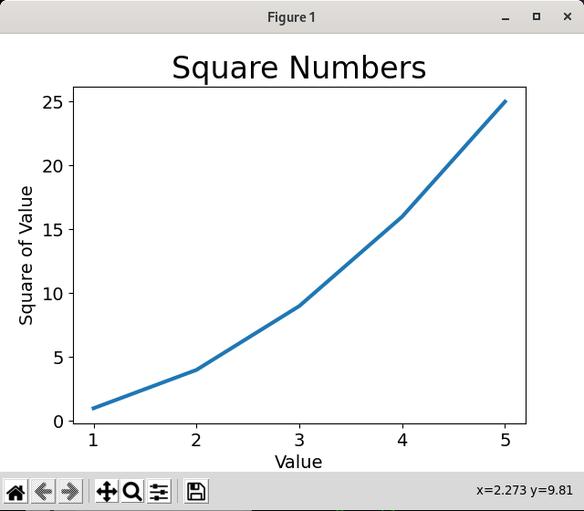

* * *

### THIS IS MY SECOND GRAPH U GUISE!

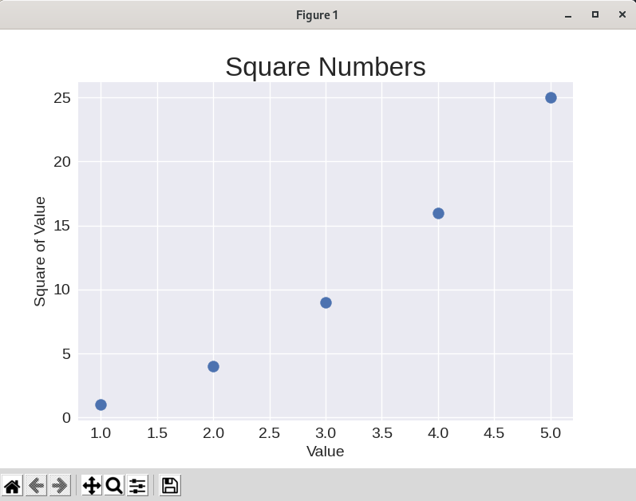

* * *

### Doing random walks, feeling like a wizard:

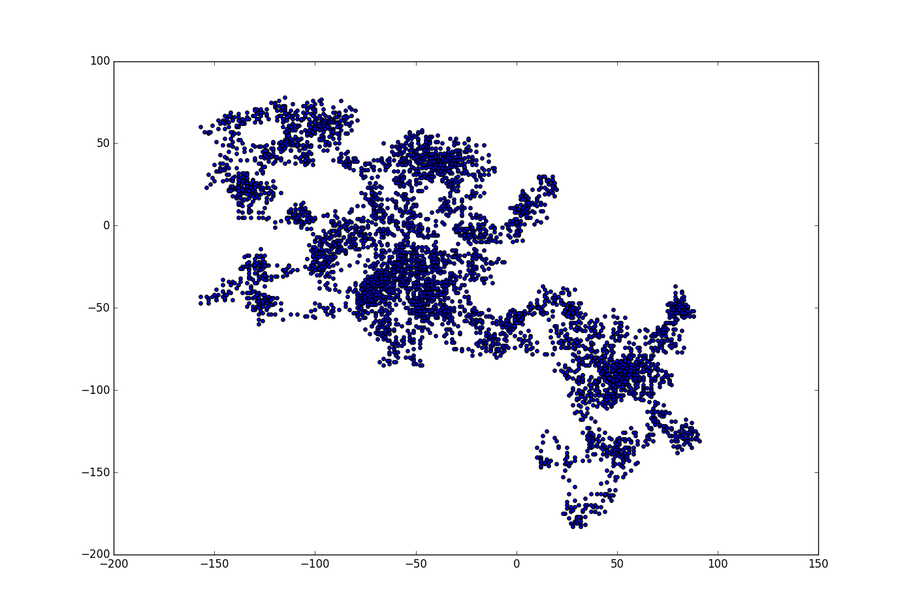

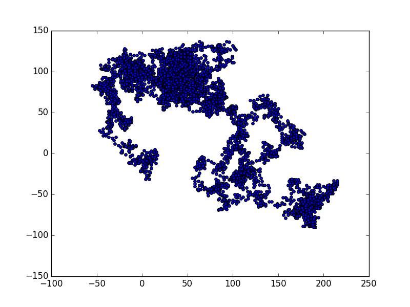

### More random walks, with different styles added!

Pretty random walk:
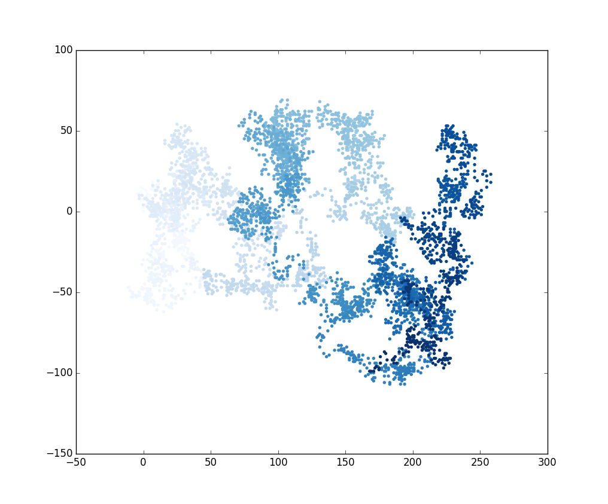

A huuuge random walk:
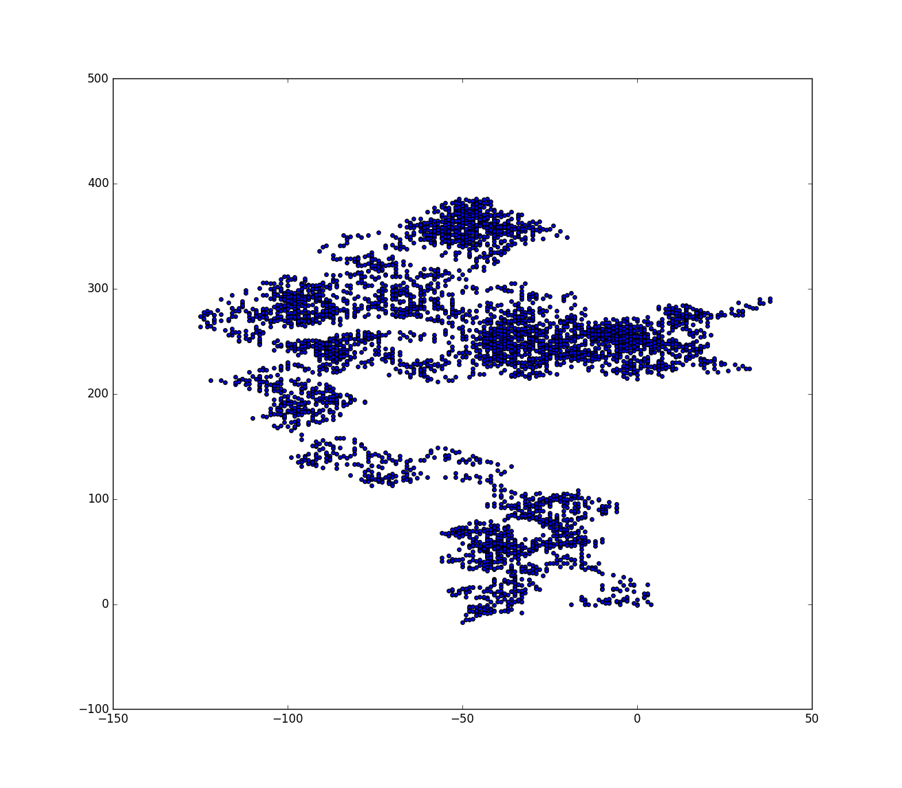

A plot that shows the start (green) and end (red) points:
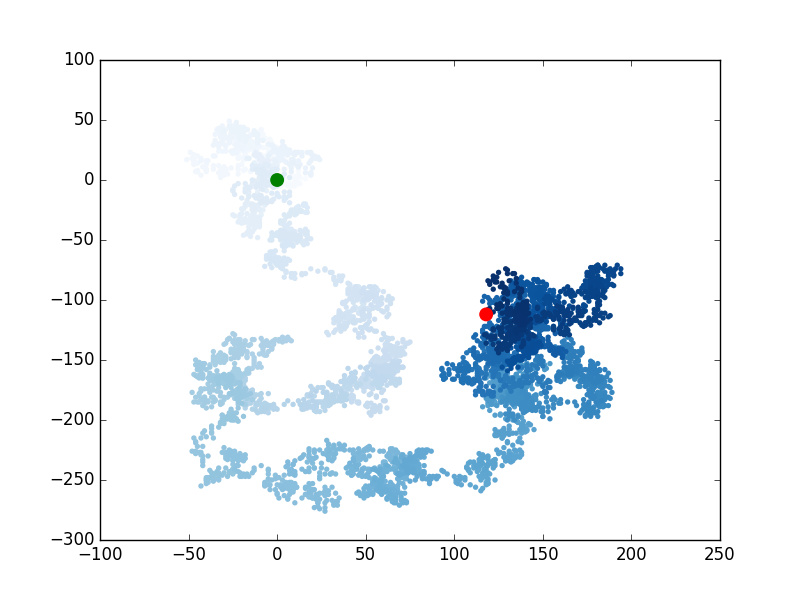

Random walk with 50,000 plotted points:
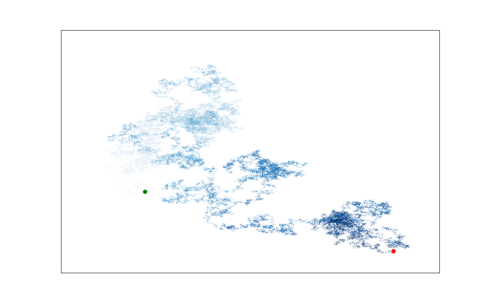

* * *

### Visualizing dice roll probabilities!

Rolling one D6 1,000 times:
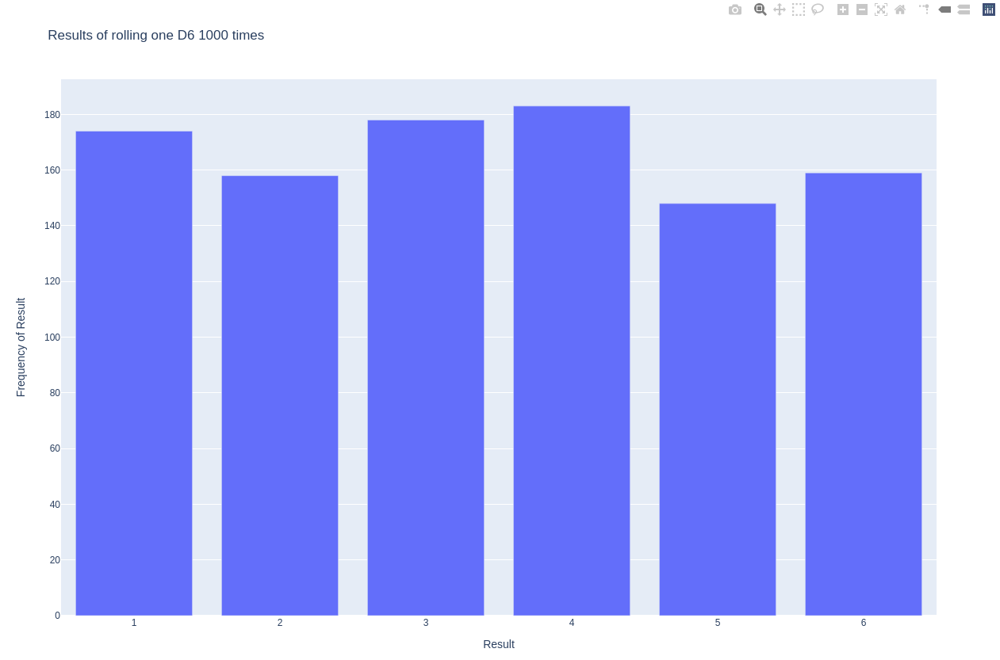

Rolling two D6s 1,000 times:
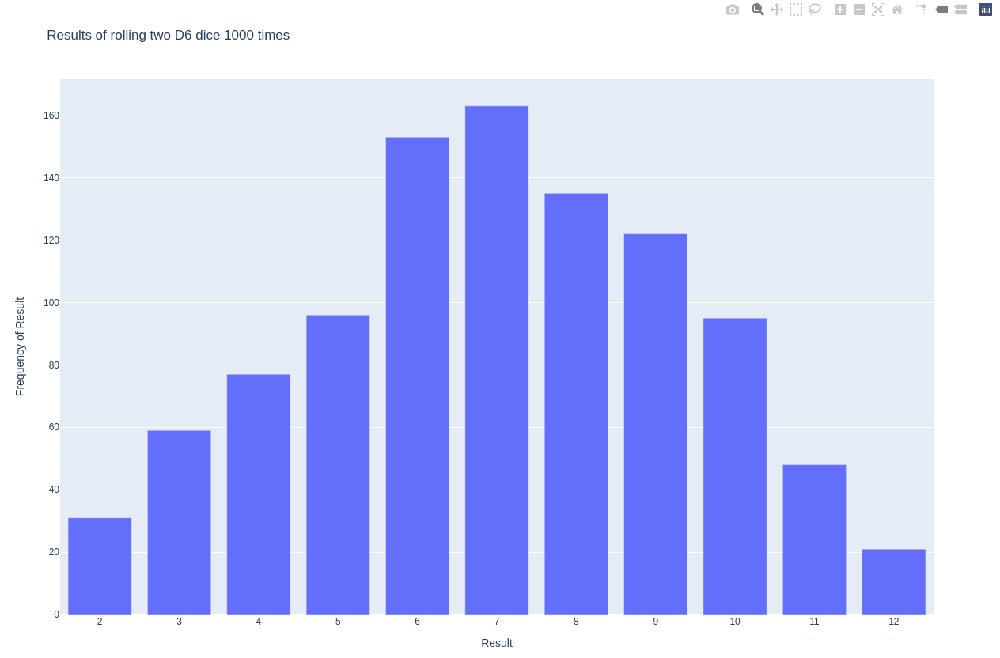

Going "Full Nerd Mode"! Rolling a D10 and D20 50,000 times:
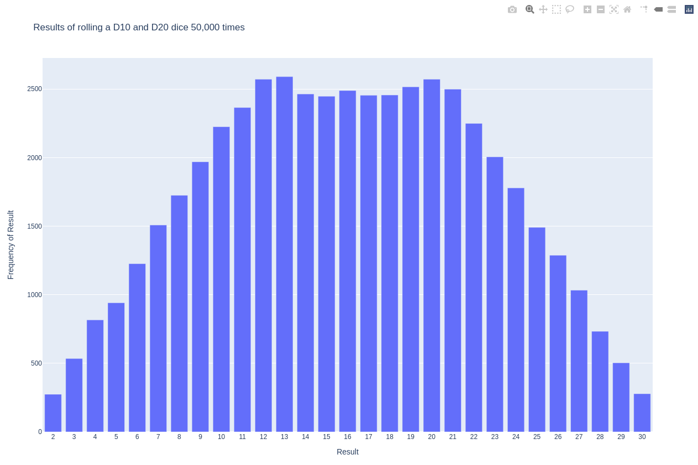

* * *

### Getting Data from the GitHub API!

⭐️ Most-Starred Python Repositories as of 5/21/2021 ⭐️:
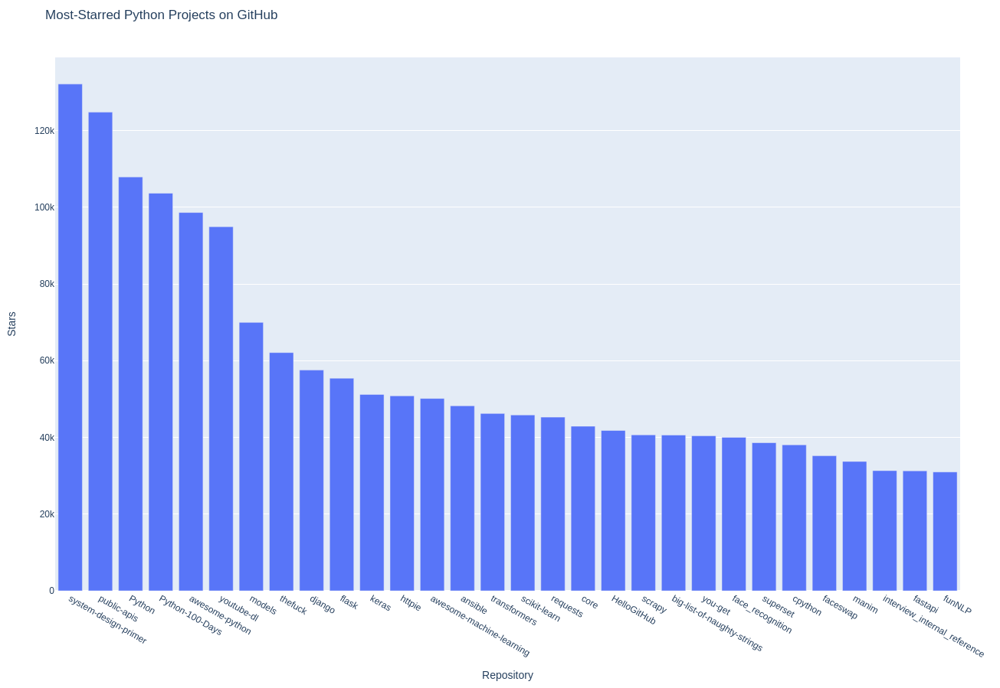

And now, with more ✨style✨:

* * *

### Most-Commented Stories on Hacker News

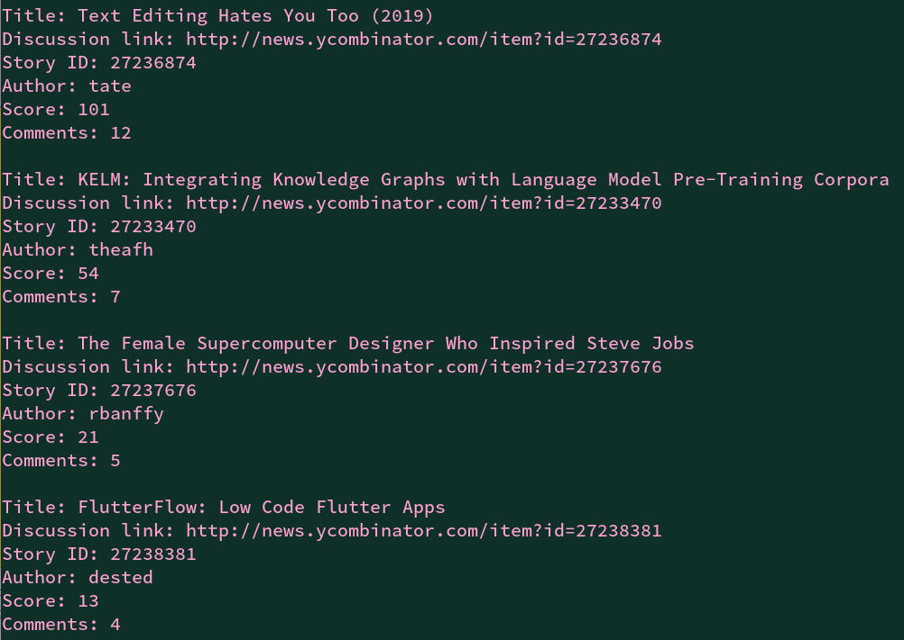
