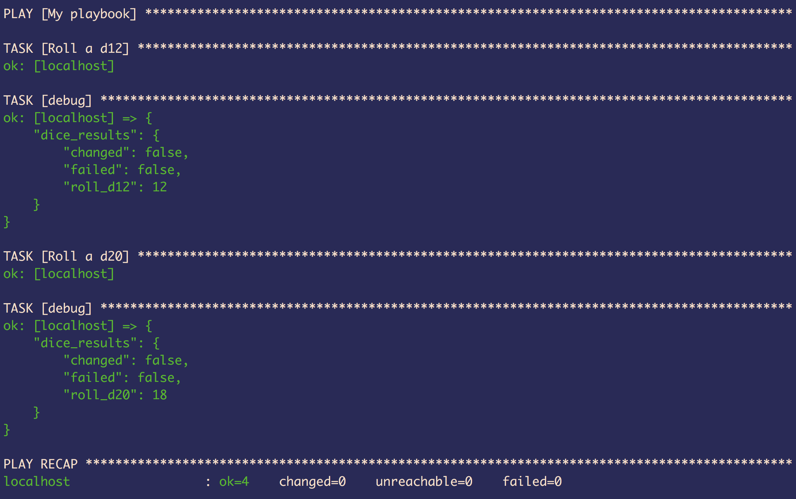

## Custom Ansible Modules

These modules are for me to practice writing modules for Ansible.

### Module Descriptions

#### `sum_module.py`

This module simply adds two numbers together.  The defaults are `0` and `1`.


#### `dice_module.py`

This module provides probably the worst way ever to roll dice. 😁

### How to Use

A practice playbook is provided in this repo (`practice_playbook.yml`).

Simply clone/download these files locally, then use your terminal to `cd` into the `Custom_Ansible_Modules` directory.  Once there, run:

```
ansible-playbook practice_playbook.yml
```

...and that's it!  If everything is working correctly, then output like what's shown below should appear on your terminal:


