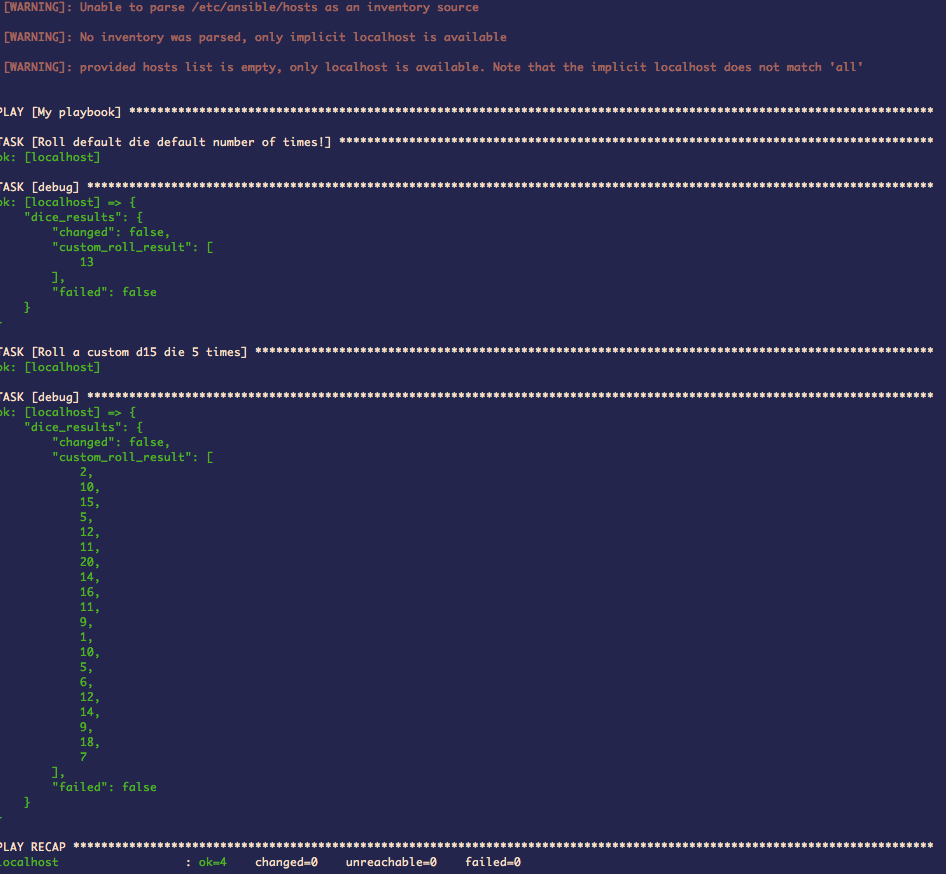

## Custom Ansible Modules

This repo exists so I can practice writing modules for Ansible.

### Module Descriptions

#### `sum_module.py`

Adds two numbers together.  The defaults are `0` and `1`.


#### `dice_module.py`

The ~worst~ BEST way ever to roll dice! 😁

Customize the number of sides you want your die to have (defaults to `20`), as well as the number of times you want to roll it (defaults to `1`).

* * *

### How to Use

A practice playbook is provided in this repo (`practice_playbook.yml`).

Simply clone/download these files locally, then use your terminal to `cd` into the `Custom_Ansible_Modules` directory.  Once there, run:

```
ansible-playbook practice_playbook.yml
```

...and that's it!  If everything is working correctly, then output like what's shown below should appear on your terminal:


