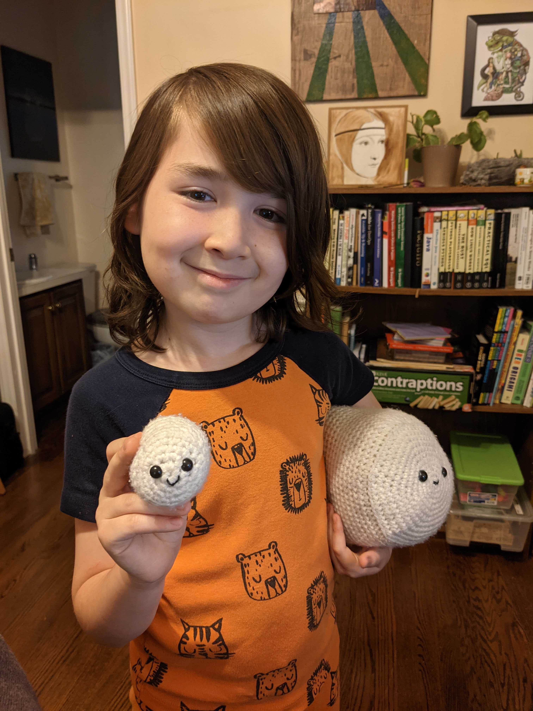
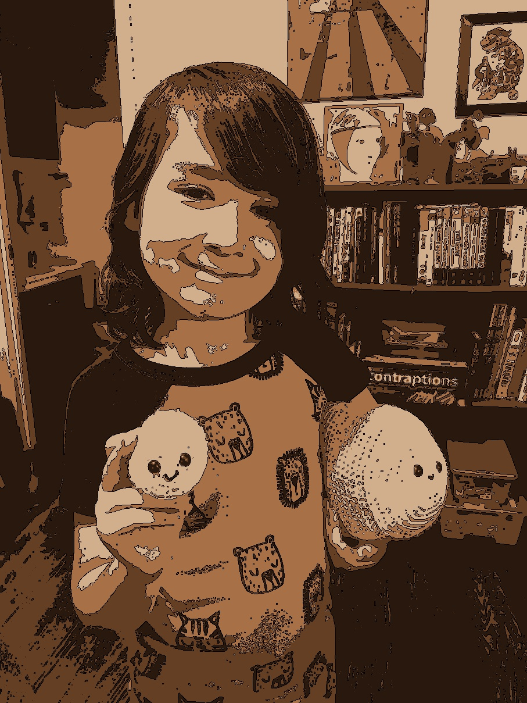

# Simple Stuff

## Misc. simple Python 3 projects for teaching myself basic concepts.


### **DrawCircle**

Draws a circle.


### **PrimeNumberGenerator**

Generates prime numbers up to a specified range.


### **TempConverter**

A very simple temperature converter script.


### **FizzBuzz**

A much famous test.


### **Lunch Randomizer**

Helps select where to go to lunch in downtown Durham, NC.


### **Magic 8 Ball**

Ask a yes or no question and get an answer!


### **PrimeNumberGenerator**

Find all prime numbers within a specified range.


### **Image Changer**

Run `image_changer.py` on any JPEG image to stylize it like so:

_Before_


_After_


> When the stylized image pops up, press any key to activate the `Save the image? [y]/[n]` prompt

Dependencies include [`cv2`](https://pypi.org/project/opencv-python/) and `numpy`. Based on the excellent tutorial found [here](https://dev.to/stokry/how-to-cartoonize-an-image-with-python-1e01)


### **Collatz Conjecture**

From [Popular Mechanics](https://www.popularmechanics.com/science/math/a29033918/math-riddle-collatz-conjecture/):
```
Take any natural number. There is a rule, or function, which we apply to that number, to get the next number.
We then apply that rule over and over, and see where it takes us. The rule is this: If the number is even,
then divide it by 2, and if the number is odd, then multiply by 3 and add 1.

Start with numbers other than 10, and you’ll still inevitably end at 1... we think. That’s the Collatz Conjecture.
```

This script takes any whole number input over `0` and returns the number of steps it takes to get that number to `1`.
